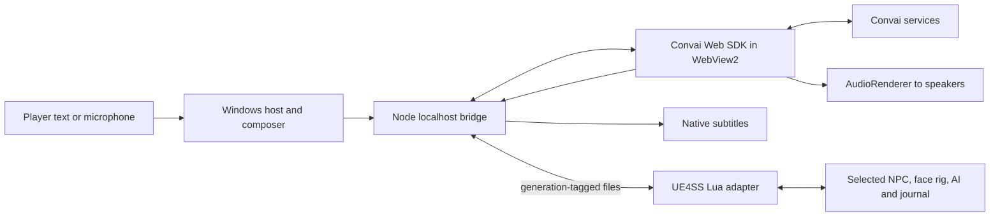

# Historical release notes and implementation guide

Preserved on 14 September 2026. This file contains superseded controls, build numbers and validation notes. Use [README.md](README.md) for current installation and behavior.

## Current build: v0.27.7 — real audio capture and latency measurements

Real Convai testing reproduced empty audio buffers that synthetic MediaStreams missed. Remote tracks now have a silent media consumer so Chromium decodes them for buffering; completed speech without PCM fails promptly. Connections still initialize during summoning, and later group replies generate while preceding characters speak.

Two real three-character tests measured the first reply at **2.59 / 3.12 seconds**, with later replies starting **40–41 ms after simulated handoff**. These are short-prompt browser measurements, excluding the game's handoff delay. Three alternative LLMs were tested; none consistently beat the existing model, which was restored. Single-chat timing diagnostics now separate connection readiness, initial text and speech delivery. 168 tests and TypeScript pass. See [methods, model trials and limitations](docs/CONVAI-LATENCY-V0277.md).

No game restart or re-summoning is required; the bridge/helper reloads automatically. Lua v0.27.5 and helper v0.27.3 stay installed.

## v0.27.6 — prepared group speech and summon connections

Summon requests now initialize Convai connections in the background, before the character finishes loading. Copies share one live connection and memory identity. Setup requests are staggered and idle connections remain ready while those characters are in the party.

The second group reply starts generating when the first speaker finalizes its text; the third can start when the second finalizes, even while the first still speaks. Remote audio, subtitles and facial frames are buffered silently and played from the beginning at the correct handoff. Prepared actions wait for playback too. This removes the requirement to start every response after the preceding audio finishes, though slow service responses or very short preceding replies can still leave a gap.

166 tests, TypeScript checking and an isolated browser audio check pass. Only bridge files change; Lua v0.27.5 and helper v0.27.3 remain installed. No game restart or re-summoning is required. See [implementation and verification](docs/GROUP-PIPELINE-V0276.md).

## v0.27.5 — keep group replies active across speakers

Group chat now measures departure from a shared twelve-metre area around where the player started the conversation. Turning the camera or handing the response to a companion behind the player no longer triggers the single-NPC walk-away rule. Leaving that area for the existing two-second grace period still releases the conversation. Single chat retains its previous distance/facing behavior.

The live log showed a successful Ambrus-to-Brencis handoff followed 1.7 seconds later by “Conversation ended: walked away.” That cancellation explains the briefly visible next subtitle and interrupted response. The new area survives handoffs and resets on actual conversation closure or a new selection. The v0.27.4 connection preparation remains enabled. 161 offline checks pass; [implementation and evidence](docs/GROUP-AREA-V0275.md). This Lua hot reload dismisses existing summons, so summon them again with F5; no game restart is required.

## v0.27.4 — faster group speaker handoffs

While a group member replies, the bridge silently prepares the next selected character's Convai connection. It promotes that exact client at handoff, attaches audio playback, and submits the message with the previous speaker's completed reply and the new speaker's own context. Only one upcoming connection is prepared; it has no microphone, audio renderer, generated reply or game-action ownership. Clones retain the same character/session and memory identity.

When the SDK confirms playback has ended and the audio/facial queues are empty, the bridge uses a 250 ms tail guard instead of the 1,200 ms fallback quiet period. Missing end markers and delayed TTS retain conservative handling. Offline checks pass (160 tests and TypeScript); actual network latency still needs gameplay observation. This bridge update retains helper v0.27.3 and Lua v0.27.1, and requires no game restart or re-summoning. See [implementation and timing diagnostics](docs/GROUP-LATENCY-V0274.md).

## v0.27.3 — F8 composer font repair

F8 reached Lua and received a ready acknowledgement, but the textbox failed during native window creation. At an equal font size, WinForms retained the old Font instance while the resize code disposed it. The exact ToHfont exception was reproduced with the bundled Afacad font. Font replacement now preserves a retained instance in both the conversation and companion panels. Closing composers also ignore late asynchronous continuations instead of recreating disposed windows.

Verification now loads the actual bundled font, creates native textbox/button handles and draws at nine scales, including the equal-size case. Companion-panel resizing and normal composer input also pass. The older input test used a temporary directory and therefore a fallback font, missing this condition. This is a helper-only update; the game and party stay loaded. See [the evidence and repair](docs/COMPOSER-FONT-V0273.md).

## v0.27.2 — helper crash recovery and voice-input cleanup

The UI helper now uses a process-lifetime keyboard callback, guards stale editor callbacks, and releases microphone state even if the device disappears while stopping capture. Its Node server belongs to a Windows job that closes with the host; the launcher also verifies and removes an orphaned server left by older builds. Recoverable UI exceptions are logged and restart the helper instead of leaving an exception dialog blocking the interface.

This is a helper update: the existing Lua companion code remains v0.27.1, and applying it does not dismiss the party or restart the game. The keyboard-lifetime repair addresses a plausible failure path in the captured native callback crash; it is not a conclusive diagnosis from a complete managed stack. See [crash evidence, implementation and checks](docs/HELPER-RECOVERY-V0272.md).

## v0.27.1 — group replies and compact companion parties

Group chat now tolerates temporary native actions and SDK streaming placeholders, switches speakers without exposing an inactive selection, and releases the final speaker's conversation hold. Nearby distinct characters still respond in relationship/topic order, up to three total; clones share their Convai identity/session. Conversation cleanup also resets the interrupted native follower path once for that exact companion, with combat and action ownership guards.

Summons form close arcs in front of Coen. Larger parties gain more places per outer arc: twenty normal-sized companions fit into three arcs. Travel uses stable side and rear places, shared space reservations and yielding rules, with a narrower fallback for obstructed lanes. Local approaches leave the settled group alone. Corrections have a shared path budget, rotating access and finite retries so a stalled member cannot keep issuing the same request.

See [the detailed implementation and evidence](docs/COMPANION-GROUP-AND-SPACING-V0271.md) and [the short gameplay check](TEST-NEXT.md). Offline checks pass; in-game walking, group audio and large-party performance still need visual verification. Hot reload dismisses the previous party. No game restart is needed.

## v0.27.0 — sustained companion combat

Owned companion clones ignore their original combat guard areas. During native combat the mod also temporarily releases the campaign follower identity that forces Defensive behavior beyond nine metres from Coen; it restores that identity for following, retreat, conversation and cleanup. Enemy selection, attacks and cooldowns stay native. Xanthe's combat movement repair now waits for the locomotion tick to apply its queued profile, fixing the earlier premature rejection.

A bounded activity log samples Brencis and Xanthe's active abilities, tickets and behavior once per game second. It supports investigation of long-fight pauses without cancelling spells or resetting cooldowns. Gameplay improvement remains to be checked. See [evidence and implementation](docs/COMPANION-PASSIVITY-V0270.md) and [the next test](TEST-NEXT.md). Hot reload dismisses the previous party; summon fresh companions with F5.

Installation paths are configurable and public documentation uses generic paths. Local manifests, logs, caches and backups stay outside shared source.

## v0.26.9 — independent enemy choices

Companions can choose any nearby active enemy. Initial choices now consider each companion's distance and how many party members already have that opponent; player aim is a small preference rather than a command for everyone. Native opponents stay stable once combat begins. Combat handoff stops restoring a default travel pose, and Xanthe receives a narrow repair for a leftover walking movement profile using her own asynchronously prepared combat asset.

Two recent sustained-run detections also help a distant fighting companion recognize the party's departure, including when its enemy is chasing beside Coen. Ambrus's confirmed idle fix and the calmer approach behavior are retained. Native attack selection, defensive states, ticket limits and cooldowns remain in control.

See the [implementation, evidence and limitations](docs/COMPANION-COMBAT-CHOICES-V0269.md) and [next gameplay check](TEST-NEXT.md). Native population bridge v8 remains unchanged; a separate small asset-loading DLL supplies the nonblocking data-asset request. No restart is needed, but Lua reload dismisses the previous party. Bakir's area-damage friendly fire remains unresolved.

## v0.26.8 — settled companions and retreat

Small approaches now leave the party's formation frame fixed, and a settled member gets at most one successful formation adjustment per real travel leg. Native follow restart uses 2.5 metres of slack while running/sprinting pace remains responsive. A sustained run away from a known fight can trigger retreat even if an enemy keeps pace; temporary retreat relations are maintained if native hostility returns.

Ambrus's live linked body instance now temporarily uses the inspected human parent's ordinary idle and turn selectors during travel. His original selectors return for combat and on lease cleanup. This addresses the observed boss-idle mismatch, but the T-pose fix and retreat behavior still need the visual gameplay check. The mod does not force-cancel unbreakable native actions.

See the [evidence, implementation and checks](docs/COMPANION-APPROACH-AND-RETREAT-V0268.md) and [short test procedure](TEST-NEXT.md). This is a Lua hot reload; existing companions are dismissed and must be summoned again. Native bridge v8 is unchanged. Bakir's area damage against Coen remains a separate unresolved issue.

## v0.26.7 — native combat handoff

The game chooses attacks, powers, dodges, combos and combat movement. The mod retains follower/combat ownership, summon recovery and conversation coordination. The old tactical graph executor is inactive and no longer watched by the runtime. An eligible native opponent now takes priority over player aim, and the mod releases its forced-target hint once native combat takes over.

This update removes the failing global movement callback, retains preparation across temporary combat-start rejections, observes both native combat flags, shares recovery budgets fairly and removes the combat ban after ordinary catch-up. Conversation holds cannot interrupt combat entry; queue errors no longer leave updates/reloads permanently pending. Formation spacing uses bounded idle path requests; moving paths belong to native AI.

**Bakir's area attacks can still hurt Coen.** His projectile/effect path has been identified, but safe damage exclusion is not implemented. A developer-only immunity construction probe crashed during investigation; it is removed and its command cleared. Native bridge v8 is unchanged.

See the [detailed review, evidence and limitations](docs/COMPANION-REVIEW-V0267.md) and [next gameplay check](TEST-NEXT.md). Earlier entries below are superseded where they conflict with this section.

## Following and combat update v0.26.6

The September 13 trace captured Anca being told to regroup while Coen was approximately one metre from an enemy. The proximity of the current fight now vetoes distance-only retreat, even when a flanking companion is far away. Returning to the same fight releases a latched regroup. Distant separation must persist for 3.5 seconds beyond the revised distance gates; ordinary dodges and circling retain native combat.

Recovery markers had Static scene roots, so every native teleport attempt was rejected. The mod now leases Movable mobility on its own DynamicSpawnPoint, moves it with `K2_SetActorLocation`, verifies the position and restores the original mobility on release. A paused, reversible 25 cm test on an owned marker confirmed movement and exact restoration. Markers update toward Coen sooner and are staggered across the party. This fixes marker movement; it does not claim that every population unload is prevented.

An idle follower outside its follow distance receives a native path request after 1.5 seconds of measured stagnation. Moving, waiting and paused paths, combat, conversations, scenes and uninterruptible actions are excluded. An eight-second cooldown and two attempts without progress prevent request spam. Safe off-camera catch-up can service one companion each 250 ms update, instead of making eleven followers wait roughly sixteen seconds for a turn. Collision, camera, grounded, combat and per-member retry checks still apply.

See [the evidence and implementation](docs/COMPANION-FOLLOW-AND-COMBAT-V0266.md). This is a Lua hot-reload update; native bridge v8 stays in use.

## Crash fix v0.26.5

The v0.26.4 first-summon crash was a native bridge regression, not a requirement to wait between clicks. Both September 13 crash dumps identify the weak-pointer constructor → `FUObjectArray::AllocateSerialNumber` path during creation of the first companion. The previous timing check used an existing spawner with a nonzero serial and did not cover newly-created objects.

Native bridge v8 never calls that constructor or allocator. It borrows an existing engine object index/serial, validates identity, and uses a five-second-throttled typed path fallback until the engine assigns a serial. Once available, recurring polls use the fast handle; an expired nonzero handle is never silently rebound to another object. Native spawn-stage markers are flushed to disk for future crash diagnosis. Concurrent UI requests, wider formation and combat behavior remain as in v0.26.4.

Offline regression tests now include fresh serial-zero objects, later engine assignment, changed serials and fallback throttling. **Gameplay spawning still needs retesting after launch.** See [the crash analysis](docs/COMPANION-SPAWN-CRASH-V0265.md).

## Companion update v0.26.4

Companions now use five wider lanes, with 3.6 metres between ordinary-sized neighbours. Eighteen summons fit within roughly 16 metres of the player instead of a long single-file tail. Their existing native follower movement aims toward these slots; combat, conversations, scenes and uninterruptible actions retain their own destinations. A blocked lane yields to the game's direct route for twelve seconds. There is no periodic idle MoveTo correction loop.

The September 13 log captured repeated 1,016–1,116 ms reconnect calls after eight pawns detached together. Native bridge v7 replaces full object-array path searches with UE4SS serial-checked weak handles. It retains the rooted population owner, but never caches a raw pawn or async-action pointer across ticks. Blocked marker/catch-up attempts back off to thirty seconds; successful catch-up resets that delay.

The game exposes `ESpawnPriority::AlwaysSpawned` and `ESpawnRange::Always`. Examined generated rows used `Default`. These settings are research findings, **not an enabled or proven keep-loaded lease**: changing a generated table after population registration may not update its live entry. Rooting the spawner prevents garbage collection of the owner, not population-system pawn unloading. World changes, death and dismissal still release the party.

See [the investigation and verification](docs/COMPANION-SPACING-AND-STREAMING-V0264.md). Existing 2.5× physical base damage and native combat selection remain active.

## Companion update v0.26.3

Crake is shown as **Crake**. F5 keeps accepting summons during loading and closes after the entire batch is ready: 1.2 seconds normally, with a three-second grace period from the last roster click/scroll. A new summon extends the batch; a failure stays visible.

Summoned companions receive **2.5× their effective physical base attack damage**, including the source AI-versus-AI fallback. Native armor, blocking, follower balancing, attack timing and ability selection still apply; this is not a promise of exactly 2.5× final HP loss or damage per second. Spell-specific damage is unchanged. `damageMultiplier` in `mod/Scripts/companion_config.lua` controls the multiplier; the generator defaults to 2.5.

After combat, inventory swords use native stow. If the combat component still holds a sword after that request, its idle weapon cleanup releases the leftover combat instances while preserving the equipped inventory class for the next encounter. Claws, active combat, scenes and uninterruptible actions are excluded. This runs on owned summons only.

See [implementation and live evidence](docs/COMPANION-CLEANUP-AND-DAMAGE-V0263.md) for the exact methods, limitations and verification.

# Dawnwalker Convai — implementation and porting guide

This mod adds open-ended Convai conversations to nearby NPCs in The Blood of Dawnwalker. It combines a UE4SS Lua game adapter, a local Node bridge, the Convai Web SDK, and a small Windows WebView2 host. The player types or uses a microphone; the NPC replies with audio, subtitles and facial animation inside the game.

This README describes the actual implementation and the investigation that produced it. It is also a guide for developers adapting the approach to another Unreal game. **The reusable architecture does not make Dawnwalker's reflected class names, facial arrays or AI behavior portable.** Those must be rediscovered and tested for every game/build.

For the player-facing description, see [PRODUCT.md](PRODUCT.md). For the latest gameplay checks, see [TEST-NEXT.md](TEST-NEXT.md). Historical notes contain old disabled states and test counts; this README describes the current implementation as of 13 September 2026.

## Current release: v0.26.2

F5 contains **SUMMON**, **YOUR PARTY**, selected companion status and **Help & Controls**. Tactics, Orders and saved-plan execution are removed. There is no Actions tab: Help explains conversation requests such as “follow me” and “stop walking”. Companions normally follow and assist in Coen's fights while their native campaign combat definition chooses attacks, positioning and abilities.

The roster contains 17 named characters. A single copy uses the plain name, such as Anca. Summoning a second makes them Anca #1 and Anca #2; returning to one removes numbering. Labels follow current summon order, whereas instance IDs remain stable. Copies share one named Convai profile, conversation session and memory identity. There is no configured party-size cap; large parties still need navigation space and engine resources.

F5 remains interactive during summon loading. Each click gets a separate request and game instance; you can select another character and queue the next immediately. The progress view shows the batch's arrivals and outstanding stages. Auto-close waits for the entire batch and 1.2 quiet seconds. Browsing the roster delays auto-close until three seconds after the last click/scroll; F5 closes manually. Short native loading stalls can still accept more summon requests within the same party epoch. The engine may still hitch during final actor construction; the independent menu does not remove that engine cost.

The travel adapter uses native follower movement with separate stopping distances and prompt pace thresholds. No global MoveTo hook, tactical aggression or role pathing competes with campaign AI. v0.26.1 distinguishes combat repositioning from sustained departure, prepares native-initiated combat even without a mod-selected target, and suppresses owned companions' detection reactions during retreat. See [the v0.26.1 investigation](docs/COMPANION-BATCH-AND-RETREAT-V0261.md) for captured evidence and limitations.

v0.26.2 corrects the live follower enum (**Walk 0, Run 1, Sprint 2**) and checks its actual value instead of trusting the last request. During travel it can lease the game's existing Runner/Sprinter profile to overcome a lingering walking profile, releasing the lease for combat, scenes, chat and Stop. The shared profiles remain unchanged. Catch-up destinations account for the real third-person camera offset and validate visibility after navigation projection; a failed arrival no longer consumes the eight-second success cooldown. Fast player movement uses a three-second success cooldown, still staggered across the party.

Logs showed repeated native pawn unloading/recreation after leaving a fight. Owned streaming spawn markers now relocate toward Coen on a bounded schedule, and reattachment waits for a surviving replacement instead of repeatedly initializing transient pawns. A companion separated by more than max(24 m, its stopping distance + 16 m) for two seconds regroups even if a new enemy is near Coen. This is an internal recovery condition, not a maximum pursuit setting. See [streaming, sprint and catch-up evidence](docs/COMPANION-STREAMING-AND-PACE-V0262.md).

| Control | Behavior |
| --- | --- |
| F5 | Summon, select/dismiss individual copies, status and Help. |
| F6 | Single-character text box; Enter/Send submits, Esc closes. |
| F7 | Single-character microphone toggle; initially off. |
| F8 | Group text box; addressed NPC answers first, up to two other distinct characters follow. |
| F9 | Group microphone; one utterance starts the round and capture stops during replies. Press again for another round. |

Single selection accepts facing the body within about 4.5 metres. Group selection prefers that aimed NPC, falling back to the nearest visible eligible humanoid within 12 metres. Additional speakers are nearby spawned companions, ranked by researched relationships, topic relevance and distance; clones do not consume multiple speaker slots. This is **three NPC speakers total**, not three plus the addressed character. Speaker handoff waits for text and audio completion, then selects the next game actor before routing facial frames. Starting another conversation cancels the old round.

Retreat considers recent combat, distance from engaged enemies, outward velocity, net travel and time. Brief dodges, circling, moving toward enemies or nearby flanking do not satisfy its running-departure rule. Sustained large separation from a companion has an additional regroup rule, independent of other enemies near Coen. This is a movement heuristic, not an explicit player-intent signal. Followers finish uninterruptible actions, exit combat, reunite and then regain combat sensing after a short delay. Catch-up is restricted to distant, grounded travellers behind the camera. A conversation Stop persists until Follow; closing chat does not cancel it. Death, scenes, world/save changes and mod reloads still apply; this is not persistent save-game storage or resurrection.

Memory now has sourced lore for all 17 companions, **32 recipient-specific quest rules**, and attributed group-hearing memories. A journal completion is not broadcast to every NPC. Normal quest progress retains the same timeline; detected rewinds, changed completed endings or a knowledge-policy change branch the memory scope. See [the memory and group implementation](docs/GROUP-CHAT-AND-MEMORY.md) and [per-character coverage](characters/QUEST-KNOWLEDGE.md).

Validation separates engine evidence from offline checks. Earlier gameplay established Anca's lip shaping and Lacra's fighting/catch-up; the user confirmed Ambrus fighting on v0.26.1. v0.26.2 adds checks for sprint thresholds, movement-profile ownership, camera-aware catch-up, bounded retries, replacement stability and regrouping while enemies remain near Coen. The existing batch, conversation and native combat checks remain. The WinForms host and client bundle compile, and menu layouts are rendered offline. Physical following and combat still need the short user check in [TEST-NEXT.md](TEST-NEXT.md). Microphone code is implemented without a physical capture test. The porting history remains below and in [companion implementation notes](docs/COMPANION-IMPLEMENTATION.md).

## Architecture and ownership



UE4SS performs game operations on the game thread. It does not implement WebRTC, record audio, or call the Core API directly. The external helper performs network and browser work. Facial application is entirely Lua through UE4SS's reflected interface; no custom native facial plugin or direct pointer writes were required. The whole product is consequently not a Lua-only application.

The Web SDK needs browser facilities for its real-time connection and audio. A Node process alone cannot replace that browser runtime. The current host embeds WebView2 and uses its installed runtime instead of shipping Electron. It still uses browser subprocesses and has a runtime dependency; there is no claim of zero overhead. [Microsoft describes WebView2's native/web embedding model here](https://learn.microsoft.com/en-us/microsoft-edge/webview2/).

### Source map

| File | Responsibility |
| --- | --- |
| `mod/Scripts/main.lua`, `live_reload.lua` | Stable bootstrap, single key registrations, versioned callbacks and mod-local reload. |
| `mod/Scripts/app.lua` | Selection lifecycle, helper/group mailboxes, periodic updates and cleanup. |
| `mod/Scripts/targeting.lua` | Proximity/facing, precise identity reads, journal and surroundings snapshots. |
| `mod/Scripts/engagement.lua` | Reversible native AI hold, smooth facing, companion mode and combat checks. |
| `mod/Scripts/companions.lua`, `companion_config.lua` | Uncapped owned party, 17 candidate definitions, native follow/combat handoff and conversation actions. |
| `mod/Scripts/companion_native.lua`, `bridge/native-source/companion_native.c` | Narrow native soft-reference/class-load/population bridge, separate from Lua facial animation. |
| `bridge/companions.mjs` | Validated summon/dismiss/follow/stop command queue; removed tactics/plans are rejected. |
| `mod/Scripts/companion_recovery.lua` | Current-population labels, wide travel rows and blocked-lane recovery, latched retreat, bounded arrival and catch-up positions. |
| `bridge/CompanionPanel.cs` | F5 roster, current party status and Help form, sharing the existing host and input strategy. |
| `bridge/CompanionControls.cs` | Buffered roster and themed buttons; repaint changed rows instead of rebuilding controls. |
| `mod/Scripts/ui_input.lua` | Balanced mouse/input lease for F5 and F8, with pause-menu-aware restoration. |
| `mod/Scripts/companion_combat.lua` | Follow/combat handoff, stable target leases, finite entry retries and encounter-exit grace. |
| `mod/Scripts/ai_state.lua` | Live AI-board ownership checks, guarded weapon-tag reads and the build-specific native combat-enable transition. |
| `mod/Scripts/face_graph.lua` | Owned face layers, proven jaw input and fixed numeric facial controls. |
| `mod/Scripts/face_inspector.lua`, `jali_probe.lua`, `jali_preview.lua` | Bounded diagnostic/legacy investigation tools, not the current network path. |
| `bridge/client.ts` | Convai session lifecycle, requests, current subtitles, audio, timed blendshape consumption and action events. |
| `bridge/server.mjs`, `protocol.mjs`, `game-context.mjs` | Local HTTP, validation, files, action queue and curated context. |
| `bridge/characters.ts`, `quest-memory.ts`, `microphone.ts` | Profile selection, scoped cloud memory and serialized capture lifecycle. |
| `bridge/WebViewHost.cs`, `DialogueOverlay.cs`, `ComposerKeys.cs` | Browser host, scaled native UI and composer keyboard handling. |
| `characters/quest-knowledge.json` | Reviewed quest-to-recipient rules and source links. |
| `scripts/provision-characters.py` | Explicit maintenance tool for Core API character/voice/model provisioning. |
| `tests/` | Pure protocol tests, mocked SDK tests and Lua execution through Fengari. |

## Development methodology: prove one layer at a time

The interaction design is to approach, face and speak to an NPC, then hear a voiced reply. Its implementation depends on the game-specific object model and facial and AI interfaces discovered during development.

The work proceeded through small independently observable milestones:

1. Confirm that the supplied loader loads this mod and produces a log/heartbeat.
2. Identify one nearby live actor, distinguish it from the player, and restore it after selection.
3. Inspect the owned facial component and prove a visible jaw movement without any network dependency.
4. Find lip shaping beyond the jaw and verify it visually with the same character.
5. Send a repeatable text request to Convai, then connect streamed facial data to the proven adapter.
6. Replace competing movement/AI controls with the game's own behavior controls.
7. Add text UI, microphone lifecycle, identity routing, actions and carefully scoped context.
8. Add regression checks for actual failure modes and preserve gameplay validation as a separate step.

This order matters: receiving excellent facial data cannot compensate for writing it into an animation input that the game never uses. Likewise, a successful network action event proves delivery, not successful movement.

## Using UE4SS to discover the game

### Loader and bootstrap

This installation uses the supplied Dawnwalker-specific UE4SS RC5 package. The package filename includes `v1.2.0-rc5` and `build25129649`; do not substitute an arbitrary upstream build and assume equivalent compatibility. The installed mod entry is beneath `Dawnwalker/Binaries/Win64/ue4ss/Mods/DawnwalkerConvai/Scripts`.

`scripts/Install.ps1 -GameDirectory "C:\Games\The Blood of Dawnwalker"` accepts your installation folder, checks the executable, records its hash and avoids overwriting an existing loader. You can also set `DAWNWALKER_GAME_DIRECTORY`. It is an initial-install tool, not the everyday update command. The generated `runtime_path.lua` points the bootstrap at this workspace's runtime folder. Development analysis tools resolve the game through that environment variable or the ignored `runtime/installation.json`; public research metadata uses a `<game>` placeholder. Share source without `runtime`, `backups`, reference archives or local installation manifests. Inspect the installer before using it on another installation: executable names and compatibility assumptions are Dawnwalker-specific.

Register keys once, dispatch engine work with `ExecuteInGameThread`, and keep network waits off that thread. A missing GUI console does not by itself prove the loader failed: inspect `UE4SS.log` and the mod heartbeat. Loader settings, DLL replacement and bootstrap changes can still require a restart.

### Dumping and reading metadata

A one-shot `DumpAllObjects()` produced `UE4SS_ObjectDump.txt`, approximately 153 MB in this run. It describes loaded objects and reflected properties/functions. It is not a complete extraction of every asset on disk. Forced asset loading was disabled. The official [DumpAllObjects documentation](https://docs.ue4ss.com/dev/lua-api/global-functions/dumpallobjects.html) also identifies the equivalent GUI dump operation.

The mod's fixed development mailbox permits a read-only `dump`, `identities`, or `aiinfo` request with general development commands disabled. It does not evaluate arbitrary Lua from the mailbox. Dumps are occasional investigation operations, never per-frame work.

Useful searches against your own dump include:

```powershell
rg -n 'SkeletalMeshComponent|AnimInstance|LinkedAnimLayer|Jali' UE4SS_ObjectDump.txt
rg -n 'CharacterName|VoiceTag|NPCDefinition|BodyType' UE4SS_ObjectDump.txt
rg -n 'Follower|StopAllActions|MainBehaviorSuspended|StartCombat' UE4SS_ObjectDump.txt
```

First establish the class, property type, function parameters and owning object from metadata. Then read only the particular value that answers the next question. Verify results on a live actor; default objects describe defaults, not necessarily the character's current state. Dump addresses helped correlate metadata but are not hardcoded into the mod.

The identity chain found here is `RebelAIBlueprintFunctionLibrary.GetAIStub(actor)` → `RebelAIStub.GetNPCDefinition()` → known definition fields such as `CharacterName`, `BodyType` and `VoiceTag`. This was more reliable than guessing names from object paths. A rabbit even reported a human-looking body-type label, so the matcher also considers definition and actor metadata.

[UE4SS's reflected struct interface](https://docs.ue4ss.com/lua-api/classes/uscriptstruct.html) supports named member reads/writes. That is a mechanism, not proof that every property conversion is safe on every loader build. See [DUMP-FINDINGS.md](DUMP-FINDINGS.md) for the recorded discoveries.

### Crash lessons and bounded inspection

An early generic property inspection crashed in native code. Offline analysis of the supplied DLL and crash stack narrowed the path to soft-object-property conversion/copying; the exact offending property remained uncertain. Another problematic path involved callback iteration over UE arrays on this pinned loader. These were loader/build observations, not universal claims about all UE4SS versions.

The resulting rules in this adapter are concrete:

- Enumerate property/function **metadata** before reading instance values. Never loop over arbitrary `object[propertyName]` values to discover what exists.
- Avoid speculative soft-reference reads and broad scans of animation instances. Retrieve components from the selected actor and follow owned links.
- Use bounded numeric `1..#array` indexing for verified arrays. Never index beyond the existing size; access can resize some wrappers. Do not use the problematic TArray callback path here.
- Validate expected array length and numeric values before writing; restore captured values afterward.
- Write and close diagnostic checkpoints before a suspect native call. `pcall` handles Lua errors but cannot catch an engine access violation.
- Reuse cached selection data. Repeated global object scans or repeated AI requests can cause stutter even without a crash.

[CRASH-NOTES.md](CRASH-NOTES.md) preserves the chronology and the [pinned UE4SS source reference](https://github.com/UE4SS-RE/RE-UE4SS/blob/97b7e501c19d8b2b7c662feee73aaa0dc1f0a4d1/UE4SS/src/LuaType/LuaUObject.cpp). Its early statements about the mod being disabled describe that historical stage.

## How Lua lipsync actually works

Anca did not expose a useful ordinary mouth-morph solution for this approach. The first visible milestone was the reflected numeric `JawOpenAlpha` on an owned linked facial animation instance. That proved access to a live input, but jaw-only movement looked poor.

The current adapter locates the character's face mesh and temporarily links the game's `ABP_FaceDefaultLayers` layer, retaining the previous layer for restoration. Its cooked path is in `face_graph.lua`. It applies `JawOpenAlpha`, then fills two verified `CurveValues` arrays:

| Cooked field in this build | Verified purpose |
| --- | --- |
| `AnimGraphNode_ModifyCurve_3` | 129 mouth, jaw and tongue controls in the adapter's explicit order. |
| `AnimGraphNode_ModifyCurve_8` | Four lip-together controls for lower/upper, left/right closure. |

The compiled graph's ordering is recorded in `directNames`; names do not get guessed from a network array's position. The bridge converts Convai's MHA-251 frame to named channels using the SDK's `METAHUMAN_ORDER_251`. Lua maps those names to the verified game arrays, checks exact sizes, bounds values to 0–1 and writes zeros for absent channels. Original array values and layers are restored on release. An incompatible direct adapter falls back to the proven jaw input and logs that quality limitation.

Convai frames are requested at 60 fps. A browser timer consumes the SDK queue according to playback time/FPS, carries fractional frames and emits the latest consumed sample. It resets on queue normalization/end conditions and avoids retaining an open mouth when data stalls. The local bridge and game loop run around 30 Hz, so this implementation does **not** deliver every 60-fps source frame into the game. It also does not claim sample-accurate game/audio synchronization.

This is a game-specific RigLogic/animation-graph adapter. Unreal characters may instead need ordinary morph targets, another linked layer, a Control Rig, or native code. Copying these two node names into another game will not create lipsync. Prove a single writable control and its restoration first, then verify a richer mapping on each rig variant. JALI exploration helped locate the speech machinery; the final streaming path does not synthesize and play a JALI animation asset.

## Convai integration

### Client, audio and sessions

The project pins `@convai/web-sdk` to **1.7.0** in `package.json` and the lockfile. We inspected the installed package/types to resolve API details rather than mixing older examples with this version. The [Convai Web SDK overview](https://docs.convai.com/api-docs/plugins-and-integrations/web-plugins/convai-web-sdk) explains the client, audio renderer, blendshape queue and memory interfaces. The code uses the vanilla client and a custom UI rather than `ConvaiWidget`.

The relevant options are:

```typescript
new ConvaiClient({
  apiKey, characterId, endUserId, characterSessionId,
  startWithAudioOn: false,
  enableLipsync: true,
  enableVideo: false,
  blendshapeConfig: { format: 'mha', output_fps: 60 },
  actionConfig: { actions: ['Follow', 'Stop Walking', 'Look At Player', 'Leave'],
                  characters: [{ name: 'Coen', bio: 'The player' }], objects: [] }
});
```

This is an explanatory subset; `bridge/client.ts` contains the actual session/context handling. An `AudioRenderer` attaches the room's bot audio for playback, and `room.startAudio()` starts playback. Typed requests call `sendUserTextMessage()`. Audio plays through the helper's speakers, not through an attached Unreal sound emitter; positional game audio has not been implemented.

The helper preconnects to the default profile, keeps a connection warm after release, and retries disconnections with bounded backoff. Epoch checks prevent late callbacks from a replaced connection taking ownership. Generation/request IDs and acknowledgements prevent repeated polling from resending an accepted message. Actor-specific session identities separate ambient NPCs even when they share a Convai character profile. A resumed session must not be assigned to the next unrelated NPC.

### Current subtitles, not history replay

Subtitles prefer `botOutput` spoken segments and `botTtsText`. Some replies only supply display text through `messagesChange`, so a current-turn fallback tracks message IDs: IDs present before the new request are excluded, and unchanged entries cannot restart an expired caption. A new submission, listening turn or LLM-start transition clears the old caption. TTS startup does not clear text already received for the current reply, because LLM text can arrive before audio starts. Removing the message-stream fallback entirely caused missing subtitles; using its last historical bot message without turn tracking caused old-message flashes. Both event orders are regression-tested. Connection checks reject old-client callbacks.

### Microphone

`Microphone` serializes enable/disable transitions through the SDK audio controls. F7/F9 request capture for the selected generation. Release, lost foreground focus, stale helper/game heartbeat, disconnection or target changes stop it. The stop path disables/unpublishes capture and releases tracks rather than merely muting outgoing samples. A denied/pending permission request is handled without silently reopening the device. Only the trusted local WebView origin may request microphone permission; video/screen features remain disabled. Tests use fake controls, not the physical microphone.

### Core API character provisioning

`scripts/provision-characters.py` is separate from normal gameplay. It reads local credentials, fetches available voices, lists managed characters, creates missing profiles, updates settings and reads them back. It uses `/tts/get_available_voices` and `/character/list`, `/character/create`, `/character/update`, `/character/get`, with the `CONVAI-API-KEY` header. Consult the script and account's current API documentation before reusing the payloads.

The roster contains 17 summonable named profiles, a Coen reference profile and ten original ambient personas. `scripts/provision-companion-extras.py` adds the ten extra named definitions once each; it never creates profiles for clones. Main biographies paraphrase the publisher's character descriptions; hidden motives were left unspecified. Catalogue voices were selected for tone, not cloned from the game's actors. This installation uses `fast-gemma-4-31b-it`; that is its configured latency-oriented choice, not a benchmark proving it is the fastest model for another account or date.

Provisioning checkpoints each successful creation before later updates. It reconciles uncertain creates with an explicit management marker, avoids blindly duplicating characters and backs off on rate limits. Do not run provisioning merely to launch the mod: it writes remote account data.

### Context and memory

There are three distinct sources of knowledge:

1. Character backstory: persistent identity/tone, provisioned through the Core API.
2. Dynamic context: current verified surroundings and NPC-specific quest facts, replaced through `updateContext({mode:'replace', run_llm:'false', ...})` so refreshes do not generate unsolicited replies.
3. Long-term memory: curated durable facts submitted using the SDK MemoryManager `addMemories()` with local acknowledgement/retry bookkeeping.

The journal is not public knowledge. `quest-knowledge.json` currently contains 32 reviewed grants across all 17 companions and sends only the eligible sentences. `companion-lore.json` holds sourced identities, topics and typed relationships; `heard-memory.ts` stores attributed group reports per character and timeline. Completion, outcomes and whether the NPC participated or received a report determine eligibility. Unknown and untranslated combinations are withheld. The bridge does not upload the raw journal or all quests to each character. Sources and report gates are documented in [the quest policy](characters/QUEST-KNOWLEDGE.md), with per-rule walkthrough links in the JSON.

Journal rollback, changed completed endings or knowledge-policy changes create a separate memory timeline/end-user scope. Ordinary active-to-completed progress retains its scope instead of letting future-save memories contaminate an older save. This is not a transactionally perfect cloud/save-game integration and does not prevent an LLM from inventing claims or remembering what the player explicitly says.

Surroundings are read from verified region/time/weather fields, refreshed approximately every five seconds and rejected when stale or for a different generation. Do not infer rain exposure, indoor status or other facts from a region name alone. Add a new contextual field only after proving both its native source and its meaning.

## Actions and native AI control

Convai returns one of four advertised action names. The bridge validates the allowlist, target, generation and request ID; Lua executes the mapped function and writes a result acknowledgement. The acknowledgement is appended to Convai's context without running a new LLM turn. Generated text is never executable Lua.

Ordinary `MoveToActor` requests originally reached Lua but competed with RebelAI's community goals. Disabling controller/brain-component ticking also did not control all of that custom system. Pausing the entire body solved movement at the cost of unnatural frozen poses.

The final conversation hold captures the relevant state, sets the RebelAI board's `bMainBehaviorSuspended`, stops current actions/action-owned montages once, stops movement and temporarily disables competing rotation flags. Actor/controller/mesh ticking continues. Facing is applied in bounded yaw steps. Existing external holds, combat and cinematics are respected; restoration unwinds captured changes instead of imposing assumed defaults.

Follow restores normal locomotion and enables the board's native temporary follower fragment. It does not continuously spam navigation requests. It preserves prior follower/leader settings for cleanup and checks for native overrides. A positive acknowledgement confirms activation of the native mode, not arrival or a clear path.

For combat-capable followers, the periodic assist checks Coen's actual hostile, living, nearby combat target, respects existing forced targets, and uses a short-lived forced target plus `StartCombatBehaviors`. No global faction changes, weapons or combat abilities are added. These RebelAI APIs are discoveries from the local dump; they are not generic UE4SS APIs. A different game's behavior tree or companion system needs a different adapter.

## Transport, UI and failure recovery

The browser talks to Node at `127.0.0.1:32123`. Host/origin checks and a session token constrain local requests. This is a local desktop boundary, not a secure public credential service. Credentials reside in ignored `runtime/convai-config.json`; never publish runtime files or real keys as part of a port.

Lua exchanges small text files with the bridge: `target.txt`, `frame.txt`, `actions.txt`, `action-result.txt`, journal/environment snapshots and UI control/heartbeat files. Facial headers contain generation and timestamp; channel lines contain name/value pairs. Wrong-generation or stale frames neutralize the mouth, and sustained bridge loss releases the actor. Writes from the bridge use temporary replacement, parsers bound input sizes, and empty action files are normal rather than errors.

The UI is an independent WinForms overlay, not the game's UMG widget. Reflected subtitle widgets were found but their ownership and input lifetimes were not established. The overlay uses the OFL-licensed Afacad font bundled under `bridge/fonts`; its family was also found in the game's UI metadata. A non-activating window keeps Dawnwalker in the foreground. Composer-only keyboard routing captures real editing keys while Lua temporarily ignores player movement/look input. Earlier focus transfers caused the pause-menu problem, so that approach was removed.

## Build, reload and validation

With Node/npm, the pinned dependencies, WebView2 SDK files under `vendor/webview2/sdk`, the Windows .NET compiler and the game-specific loader available:

```powershell
npm ci
npm run check
npm test
npm run build
powershell -NoProfile -ExecutionPolicy Bypass -File scripts/Build-WebView.ps1 -OutputName ConvaiHost.next.exe
```

These commands build local code; they do not install a compatible loader for an arbitrary game. `vendor` and `runtime` are ignored and must be supplied/configured separately. `scripts/Install.ps1` documents this installation's initial deployment. Runtime configuration and generated paths must point to your workspace, not this developer's machine.

The stable bootstrap watches the selected modules listed in [AUTO-RELOAD.md](AUTO-RELOAD.md). Two matching snapshots debounce saves. It releases the old actor state, invalidates old callbacks and retains the previous working version if compilation/initialization fails. UE4SS-wide hot reload remains off. Mod-local reload cannot contain a native crash. The companion update extends the existing loader's shared module list in memory, so these new Lua modules do not require a restart. Changing the stable bootstrap or UE4SS itself still does.

After rebuilding the browser/native helper, write a reason to `runtime/background-restart.request`. The game-side supervisor runs `scripts/Start-Background.ps1`, which restarts the owned helper and swaps `ConvaiHost.next.exe`. Verify the marker/staged executable are consumed and the heartbeat recovers. Do not kill an unknown process merely because it owns the expected port.

The conversation regression suite covers malformed/stale messages, replay prevention, NPC session separation, current-only subtitles, walk-away rules, native AI state restoration, combat filtering, quest recipient rules and mocked microphone transitions. The three focused companion tests cover order semantics, partial/stale snapshots and queue/preset behavior. TypeScript and native compilation are separate checks. Fengari validates Lua logic against mocks; it cannot validate native layouts, animation quality, navigation or combat. Standalone `--preview-ui`, `--preview-companions` and `--verify-input` helper modes check forms without sending game input.

For a port, repeat these gameplay checks incrementally: select/release, known scalar facial preview, rich face mapping, one text/audio reply, repeated replies, movement/idle transitions, actions, failure cleanup, then quest/context features. Test reloading while engaged, actor unloading, another save, a new NPC, and network loss. Keep logs of the last native operation, not just a generic success banner.

## Companion methodology, controls and limits (v0.26.2)

The companion expansion starts from the local object dump and a read-only asset-registry catalogue, then joins exact character definitions to their native AI and abilities. All seven requested characters and ten extras are in `characters/companion-config.json` and the generated Lua counterpart. A located class is treated as a candidate until its spawn and behavior are observed. The publisher/wiki supplied identity and lore; local reflection supplied executable names and signatures. The full step-by-step investigation, APIs and build instructions are in [COMPANION-IMPLEMENTATION.md](docs/COMPANION-IMPLEMENTATION.md), with the 55-option survey in [COMPANION-POSSIBILITIES.md](docs/COMPANION-POSSIBILITIES.md).

F5 provides the roster, uncapped party list with duplicate summons, individual dismissal, health/status and Help. Follow and Stop are conversation actions, not another menu tab. Tactical roles, aggression and priority settings, health/stamina withdrawal policies and order graphs are no longer active. Native attack-ticket scheduling, role positions, ability selection and global AI config are not rewritten by this version.

Spawning uses a small C bridge because this build's 40-byte soft-class parameters are incompatible with the RC5 Lua soft-reference copy path. Engine-created values stay in native parameter buffers. Reflection resolves functions and field offsets, with size guards and engine property lifecycle calls. A fixed-operation request/reply file avoids linking another Lua runtime. Native class loading and Anca's definition inspection succeeded while paused. The bridge's population spawn, poll and stop paths are integrated, but require gameplay validation. Facial animation remains entirely in the existing Lua adapter.

The manager tracks the paths of its own async actions and population spawners, resolves only pawns exported by those spawners, and rejects unexpected multiple-pawn results. Native v3 resolves and checks object classes on each operation: the short-lived spawn action can become invalid while its spawner still owns the companion. Dismissal can therefore stop the recorded spawner after the action expires. The adapter sets pairwise friendship and follower state on the clone and retains attitude/hold state for cleanup. Hot reload dismisses the party and releases owned holds/attitudes. Story NPCs are not recruited or destroyed by the party manager. Normal conversation release does not remove party membership.

Combat decisions use a bounded native enemy query and short target requests. The game handles movement, attacks, abilities and animations. Distance-based retreat has hysteresis; there are no health/stamina policy overrides or free healing. Ability diagnostics read the native AI's current grants without using them as an activation gate or complete capability list: native action-tree fragments can supply abilities on demand. There are no manual or timed power requests. Native target, form, encounter, cost and cooldown requirements remain decisive; player-specific boss branches may not run against NPCs. Encounter teleports, clones, summons and transformations are not exposed as mod commands.

Earlier releases compiled a limited English order vocabulary into validated state graphs. Those modules and saved files remain as development history, but the running companion manager does not load an executor and the authenticated bridge rejects preview/configure/plan/save/attack/hold requests. Old saved files are not deleted or replayed. The current queue accepts only summon, dismiss, dismiss-all, follow and stop, while retaining epoch, timestamp, replay and actor-identity checks.

Conversation actions on a summoned pawn route through its existing party manager. Follow releases the conversation hold before enabling party travel; it does not start the separate world-NPC follower adapter. Stop persists in party state and holds an ordinary idle after native combat finishes. Look At Player is temporary facing. Leave ends the conversation without dismissing a summoned companion. Non-party NPCs retain the reversible conversation adapter.

### Menu organization, input and performance

The left side switches between SUMMON and YOUR PARTY, retaining selection and scroll position. Summon and dismiss-party stay beside the list, with individual Dismiss next to the selected companion. The right side shows status and a Help section with **Getting started**, **Conversation** and **Troubleshooting** topics. No Actions, Tactics or Orders tab is present. The loading view uses the same space, keeps the roster interactive and tracks every summon in the batch. Auto-close waits for the whole batch, with a three-second grace period after the last roster interaction.

The UI uses a 1080 × 720 reference canvas scaled to the actual game client area, with distinct title, label and body sizes. Help explains defaults, native abilities, waiting/following, leaving fights, loading, duplicates, chat keys, memory and reloads. Topic changes perform no game operations. The existing input lease and change-only redraw remain in use.

The visual reference was the ability menu in [Xbox Wire's official Dawnwalker preview](https://news.xbox.com/en-us/2026/07/07/the-blood-of-dawnwalker-hands-on-preview/): charcoal backgrounds, warm cream text, muted brass rules, selected tab underlines and small diamond ornaments. The controls draw their own decoration; no game artwork was copied. The bundled Afacad family supplies the typography.

Two independent problems caused the reported bad feel. The installed UEHelpers implementation of `GetPlayerController` calls `FindAllOf`, scanning the object array. Calling it from the 250 ms companion tick introduced four full scans per second. `Targeting.playerController` now reuses the live controller, validates it and throttles failed loading-screen lookups. A 400-tick regression confirms that a valid controller is discovered once. Enemy selection still uses the bounded native query, not a global object scan.

Separately, showing `bShowMouseCursor` and ignoring look input did not release gameplay mouse capture. Each overlay now takes one `ui_input` lease using the dump-verified `SetInputMode_GameAndUIEx` signature, with DoNotLock and a visible cursor. Close, heartbeat expiry and reload balance the movement/look ignore counters and restore ordinary gameplay routing when unpaused. They leave the native pause UI routing available when paused. No repeated focus or cursor-position calls occur during menu refresh. The nonactivating Windows overlay and existing real-key hook remain in use.

The old ListBox was invalidated five times a second and the form repeatedly received layout calls. The new roster keeps its controls and selection stable, paints only changed hover/selection/member rows, and buffers its drawing. Window bounds and fonts change only when the game window changes size or position. State polling can still receive fresh health and status without redrawing unchanged labels. The panel is opaque to avoid layering the whole menu solely for a slight transparency effect.

Live ability-property arrays expose `GameplayAbilitySpec` directly in this build, so grants are read with `Items[i].Ability`. Applying the AssetRegistry out-parameter wrapper pattern (`:get()`) to these live property entries caused the observed ability-read error. Porting lesson: inspect the value representation at each API boundary, even when both values look like arrays of structs. Detailed ability errors are logged once per changed error; the menu shows a short explanation.

Earlier UI regressions are retained alongside v0.26.1's focused checks. Offline layout renders and compile checks do not establish in-game mouse feel or frame pacing; the user's gameplay report is the remaining validation for those effects.

## References and what each contributed

| Reference | Role in this project |
| --- | --- |
| [User-supplied demonstration video](https://www.youtube.com/watch?v=QGpz1Ug4FMY) | Reference for the intended experience; no claim that a video proves this implementation's APIs. |
| [Convai Web SDK](https://docs.convai.com/api-docs/plugins-and-integrations/web-plugins/convai-web-sdk) and [package](https://www.npmjs.com/package/@convai/web-sdk) | Service integration; local pinned package/types were used for exact version behavior. |
| [UE4SS dump API](https://docs.ue4ss.com/dev/lua-api/global-functions/dumpallobjects.html) and [struct access](https://docs.ue4ss.com/lua-api/classes/uscriptstruct.html) | Reflection tools and how Lua reaches verified fields. |
| [Epic MetaHuman rig description](https://dev.epicgames.com/metahuman/metahuman-dna-rig-definition-and-rig-operation) | Background for investigating graph/RigLogic inputs instead of assuming ordinary mouth morphs. |
| [Publisher character pages](https://en.bandainamcoent.eu/dawnwalker/the-blood-of-dawnwalker/characters/) | Main-character biography sources, linked individually by the provisioning code. |
| [Quest policy and linked walkthroughs](characters/QUEST-KNOWLEDGE.md) | Evidence for who should know each reviewed quest fact. |
| [Microsoft WebView2](https://learn.microsoft.com/en-us/microsoft-edge/webview2/) | Lightweight host architecture and runtime dependency. |
| Local UE4SS dump, logs, crash evidence and user gameplay reports | Evidence for this exact build's object ownership, facial controls, AI behavior and visible results. |

To adapt this work, retain the separation between conversation service, transport and game adapter. Replace the target/identity, facial, AI and world-state implementations with evidence from the destination game. Begin with one NPC and one reversible control; broaden only after that path is observable and recoverable.

The v0.23 combat/loading corrections and their exact limits are documented in the final section of [COMPANION-IMPLEMENTATION.md](docs/COMPANION-IMPLEMENTATION.md).
